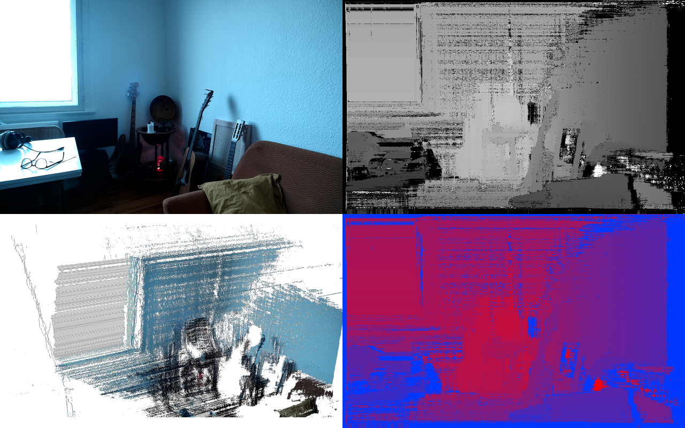

# OAK-D Long Range Depth Image in Touchdesigner
OAK-D Long Range's Depth image isn't working in Touchdesigner out of the box:
https://forum.derivative.ca/t/oak-d-long-range-depth-not-working/

This repository is a short documentation and starting point, to get depth working in Touchdesigner. (This is just the first working solution, not very elaborated yet.)

The .tox or .toe files should work with Touchdesigner 2023.12120 and an OAK D LR connected via USB.

# Preview


# Code used:
```
import depthai as dai

def createPipeline(oakDeviceOp):
    OakProject = parent.OakProject

    # Load default parameters
    op('oakStereoDepthConfig').par.Loaddefaults.pulse()
    op('oakDeviceConfig').par.Loaddefaults.pulse()

    # Create pipeline
    pipeline = dai.Pipeline()

    # === Create nodes ===
    left = pipeline.create(dai.node.ColorCamera)
    center = pipeline.create(dai.node.ColorCamera)
    stereo = pipeline.create(dai.node.StereoDepth)

    xinStereoDepthConfig = pipeline.create(dai.node.XLinkIn)

    xoutLeft = pipeline.create(dai.node.XLinkOut)
    xoutRight = pipeline.create(dai.node.XLinkOut)
    xoutDepth = pipeline.create(dai.node.XLinkOut)
    xoutDisparity = pipeline.create(dai.node.XLinkOut)
    xoutRectifiedLeft = pipeline.create(dai.node.XLinkOut)
    xoutRectifiedRight = pipeline.create(dai.node.XLinkOut)

    # === Set stream names ===
    xinStereoDepthConfig.setStreamName("stereoDepthConfig")
    xoutLeft.setStreamName("left")
    xoutRight.setStreamName("right")
    xoutDepth.setStreamName("depth")
    xoutDisparity.setStreamName("disparity")
    xoutRectifiedLeft.setStreamName("rectified_left")
    xoutRectifiedRight.setStreamName("rectified_right")

    # === Camera Config ===
    resolution = dai.ColorCameraProperties.SensorResolution.THE_1200_P
    fps = 30  # or OakProject.par.Monofps.eval()

    left.setResolution(resolution)
    left.setBoardSocket(dai.CameraBoardSocket.LEFT)
    left.setIspScale(2, 3)
    left.setFps(fps)

    center.setResolution(resolution)
    center.setBoardSocket(dai.CameraBoardSocket.CENTER)
    center.setIspScale(2, 3)
    center.setFps(fps)

    # === StereoDepth Config ===
    stereo.setDefaultProfilePreset(dai.node.StereoDepth.PresetMode.HIGH_DENSITY)
    stereo.initialConfig.setMedianFilter(dai.MedianFilter.KERNEL_7x7)
    stereo.setLeftRightCheck(True)
    stereo.setExtendedDisparity(True)
    stereo.setSubpixel(True)
    stereo.setRectifyEdgeFillColor(0)  # black edges
    stereo.setRuntimeModeSwitch(True)

    # === Linking ===
    # Stereo pair: LEFT-CENTER
    left.isp.link(stereo.left)
    center.isp.link(stereo.right)

    # Send configuration
    xinStereoDepthConfig.out.link(stereo.inputConfig)

    # Outputs
    stereo.syncedLeft.link(xoutLeft.input)
    stereo.syncedRight.link(xoutRight.input)
    stereo.depth.link(xoutDepth.input)
    stereo.disparity.link(xoutDisparity.input)
    stereo.rectifiedLeft.link(xoutRectifiedLeft.input)
    stereo.rectifiedRight.link(xoutRectifiedRight.input)

    return pipeline
```
